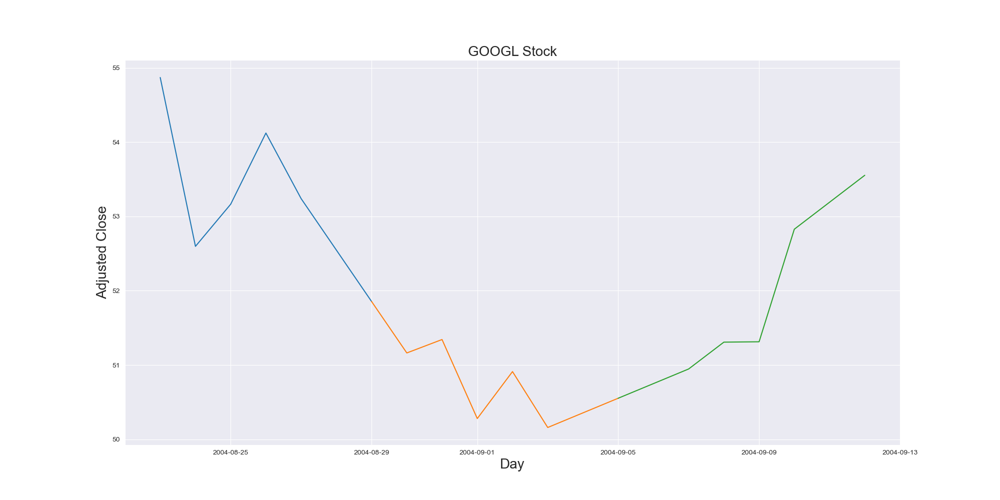

# GOOGL Stock Price Prediction and Analysis

## Project Overview

This project involves analyzing and predicting stock prices using historical data. The analysis includes decomposing time series data to understand its components, training a linear regression model, and evaluating the model's performance. The project uses various techniques for data preparation, feature engineering, and model evaluation.

## Features

- **Data Retrieval**: Fetches historical stock prices from a CSV file.
- **Time Series Decomposition**: Decomposes the time series into trend, seasonal, and residual components for different frequencies (monthly, weekly, quarterly, and annually).
- **Feature Engineering**: Creates features such as lagged prices and time-based attributes (e.g., day, week, month, year).
- **Model Training and Prediction**: Trains a linear regression model and performs iterative predictions to update the model.
- **Performance Evaluation**: Calculates and displays performance metrics including Mean Squared Error (MSE) and R-squared (R²).
- **Visualization**: Plots actual vs. predicted stock prices and visualizes the decomposition components.

## Usage

1. **Load Data**: Fetch the stock price data and save it as a CSV file if not already available.
   
2. **Decompose Time Series**: Perform seasonal decomposition on the data for various frequencies (daily, weekly, monthly, quarterly, and annually).

3. **Train Model**: 
   - Load and preprocess the data.
   - Create lagged features and split the data into training and testing sets.
   - Train a linear regression model and perform iterative updates.

4. **Evaluate Model**: 
   - Calculate performance metrics such as Mean Squared Error (MSE) and R-squared (R²).
   - Visualize the actual vs. predicted stock prices.

5. **Visualization**: Generate plots to compare actual prices with predictions and visualize decomposition results.

## Code Overview

- `Data Retrieval`: Fetches and saves stock data from Quandl.
- `Time Series Decomposition`: Analyzes data seasonality and trends.
- `Feature Engineering`: Prepares data for modeling.
- `Model Training`: Implements linear regression and iterative prediction.
- `Model Evaluation`: Assesses model performance with metrics and visualizations.

## GOOGL Stock

## 3 DAYS OF GOOGL Stock

## Predicted Stock

## Seasonal Decomposition Quarter

